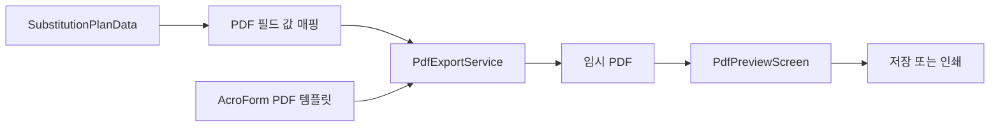
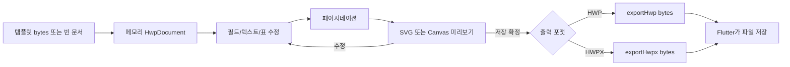
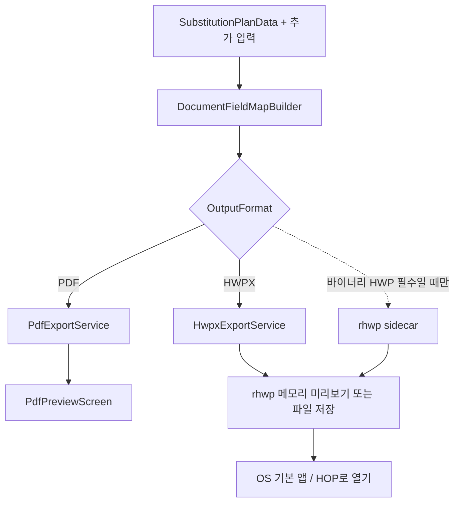

# HWP 출력 추가를 위한 HOP 검토 및 구현 방향

## 1. 문서 목적

현재 PDF 출력은 유지하면서 편집 가능한 한글 문서 출력을 추가할 때, [HOP](https://github.com/golbin/hop)를 직접 통합할 수 있는지와 프로젝트에 맞는 구현 순서를 결정한다.

- 조사 기준일: 2026-08-29
- 조사 대상: HOP v0.4.4, 기반 엔진 rhwp v0.8.4, 현재 프로젝트의 PDF 출력 경로
- 이 문서는 방향 결정 문서이며 아직 제품 코드를 변경하지 않는다.
- `.hwp`와 `.hwpx`는 구현 난이도가 크게 다르므로 별도 포맷으로 구분한다.

## 2. 결론

### 권고안

1. PDF 출력은 기존 미리보기·인쇄 경로로 유지한다.
2. 양식 편집 시 플레이스홀더 길이가 레이아웃을 바꾸므로, 1차 한글 출력은 **HWPX 템플릿 + 이름 있는 누름틀 필드 + rhwp 이름 기반 치환**을 우선 PoC한다.
3. HOP는 앱 내부 생성 엔진이 아니라 **결과 파일 열기 및 호환성 검증 도구**로 사용한다.
4. 사용자 요구가 반드시 바이너리 `.hwp`여야 한다고 확인된 경우에만 **rhwp 기반 별도 변환/생성 sidecar PoC**를 진행한다.
5. 단순 `{{placeholder}}` 치환은 rhwp 통합이 불가능할 때의 fallback으로만 둔다.
6. HOP 소스 전체를 Flutter 앱에 직접 포함하거나 HOP GUI를 자동 조작하는 방식은 채택하지 않는다.

### 한 줄 판단

> HOP 자체는 생성 SDK가 아니지만 기반 엔진 rhwp는 HWPX 누름틀을 이름으로 조회·치환하고 저장 전 렌더링할 수 있다. 템플릿 화면과 결과 양식의 차이를 줄이려면 긴 `{{...}}` 문자열보다 이름 있는 누름틀이 적합하다.

### 저장 전 미리보기 판단

**rhwp 엔진을 사용하면 HWP/HWPX 파일을 디스크에 생성하기 전에 미리보기할 수 있다.** 템플릿 바이트를 메모리의 `HwpDocument`로 로드하거나 빈 문서를 만들고, 값을 수정한 동일 문서 객체를 SVG/Canvas로 렌더링한 뒤 사용자가 확정할 때만 HWP/HWPX 바이트를 내보내면 된다.

단, 이 기능은 Flutter/Dart API가 아니다. 현재 앱에서 사용하려면 다음 중 하나가 추가로 필요하다.

- `@rhwp/core` WASM을 실행하는 로컬 WebView/웹 호스트
- rhwp Rust 코어를 감싼 native sidecar/FFI
- 전체 편집 UI가 필요할 경우 셀프 호스팅한 `@rhwp/editor`

## 3. 현재 PDF 출력 구조

현재 흐름은 다음과 같다.

주요 결합 지점은 다음과 같다.

| 역할 | 현재 코드 | HWPX 추가 시 처리 |
|---|---|---|
| 출력 데이터 | `SubstitutionPlanData` | 그대로 재사용 |
| 필드명 규칙 | `lib/utils/pdf_field_config.dart` | 포맷 중립 필드 맵으로 추출 권장 |
| PDF 생성 | `lib/services/pdf_export_service.dart` | 변경하지 않고 병행 |
| 일괄 출력 | `lib/services/batch_pdf_export_service.dart` | 2차 단계에서 포맷 선택 확장 |
| 출력 버튼 | `substitution_output_widget.dart` | PDF와 HWPX 동작 분리 |
| 미리보기 | `PdfPreviewScreen` | HWPX에는 직접 재사용 불가 |

현재 `PdfExportService.exportSubstitutionPlan()`은 PDF 템플릿을 읽고 AcroForm의 `date.0`, `teacher.0` 같은 필드를 직접 채운다. HWPX에서도 같은 키를 사용하면 데이터 매핑 중복을 줄일 수 있다.

## 4. HOP 분석

### 4.1 HOP의 성격

HOP는 HWP/HWPX 파일을 열고 가볍게 편집하며 저장·PDF 내보내기·인쇄를 제공하는 멀티플랫폼 데스크톱 앱이다.

- 앱 셸: Tauri 2
- 데스크톱 계층: Rust
- 편집기/렌더러: rhwp의 Rust + WebAssembly/웹 편집기
- 지원 OS: Windows, macOS, Linux
- 라이선스: MIT
- 최신 확인 릴리스: v0.4.4 (2026-08-28)

HOP 저장 동작의 중요한 제한은 다음과 같다.

- HWP 파일 열기 및 HWP 저장 지원
- HWPX 파일 열기 지원
- HWPX 저장은 serializer 안정화 전까지 HOP UI에서 차단
- PDF 내보내기와 인쇄 지원
- autosave/recovery는 아직 준비 중

### 4.2 프로젝트에 바로 연결하기 어려운 이유

HOP 저장소 루트 패키지는 `private: true`이고 배포용 SDK 패키지가 아니다. 데스크톱 내부에는 `query_document`, `mutate_document`, `commit_staged_hwp_save` 같은 Tauri command가 있지만, 이는 실행 중인 HOP 앱 내부 세션용 IPC이다.

현재 확인된 공개 경계에는 다음이 없다.

- Flutter/Dart 패키지
- 외부 앱용 안정 API 또는 로컬 HTTP API
- 템플릿과 JSON을 받아 `.hwp`를 생성하는 공식 CLI
- HOP 실행 파일을 headless 생성기로 사용하는 계약

따라서 HOP를 직접 통합하려면 사실상 HOP/rhwp 일부를 포크하거나 Rust sidecar를 새로 만들어야 한다. 이는 단순 출력 포맷 추가보다 배포, ABI/API 고정, 업데이트, 보안, 테스트 범위를 크게 늘린다.

### 4.3 rhwp가 의미하는 가능성

HOP의 기반인 rhwp는 HWP 5.0/HWPX 파싱, 표·문단 렌더링, HWP 편집 저장, HWPX→HWP 변환, hwpctl 호환 Action/Field API를 제공한다. 따라서 **바이너리 HWP 생성이 필수일 때의 기술 후보는 HOP GUI가 아니라 rhwp 엔진**이다.

다만 현재 rhwp는 v0.8.x 단계이며 v1.0 조판 엔진을 향해 개발 중이다. 프로젝트에 포함하려면 버전을 고정한 좁은 PoC와 실제 학교 양식 corpus 회귀 테스트가 선행되어야 한다.

### 4.4 rhwp의 저장 전 미리보기 경로

rhwp의 `HwpDocument`는 문서 상태와 렌더링 상태를 메모리에 유지한다. 공개된 WASM API에서 다음 흐름이 확인된다.

1. 기존 HWP/HWPX 템플릿 바이트로 `new HwpDocument(bytes)`를 호출한다.
2. 또는 `HwpDocument.createEmpty()`/내장 blank document로 새 문서를 시작한다.
3. 텍스트·표·필드·서식 편집 API로 메모리 문서를 수정한다.
4. `pageCount()`로 재조판된 페이지 수를 얻는다.
5. `renderPageSvg(page)` 또는 `renderPageToCanvas(...)`로 화면에 표시한다.
6. 사용자가 저장을 확정할 때만 `exportHwp()` 또는 `exportHwpx()`로 바이트를 만든다.
7. 반환된 바이트를 Flutter 호스트가 선택한 경로에 기록한다.

따라서 여기서 말하는 “생성 전 미리보기”는 **최종 파일을 디스크에 쓰기 전 미리보기**이다. 렌더러가 볼 문서 상태 자체는 메모리에 먼저 구성되어야 하며, 템플릿을 사용하는 경우 원본 템플릿 바이트는 읽어야 한다.

#### 사용할 API 선택

| 경로 | 저장 전 미리보기 | 자동 필드 주입 | Flutter 통합 난이도 | 비고 |
|---|---|---|---|---|
| `@rhwp/core` | 가능: `renderPageSvg`, Canvas | 가능: 저수준 편집/Field API | 중~높음 | 자동 생성 + 전용 미리보기에 가장 적합 |
| `@rhwp/editor` | 가능: 편집 UI, `getPageSvg` | 공개 호스트 wrapper는 로드/렌더/내보내기 중심 | 높음 | 사용자가 직접 편집하는 전체 UI에 적합 |
| Rust `DocumentCore` | 가능: `render_page_svg_native` | 가능 | 높음 | Windows sidecar/FFI에 적합 |
| HOP 실행 앱 | 가능하지만 HOP 자체 UI 안에서 수행 | 외부 앱용 자동 주입 API 없음 | 매우 높음 | 본 프로젝트 내부 미리보기 경로로는 비권고 |

`@rhwp/editor`의 공개 wrapper는 `loadFile`, `pageCount`, `getPageSvg`, `exportHwp`, `exportHwpx`를 제공한다. 그러나 호스트 Flutter 코드가 필드를 일괄 변경하는 공개 메서드는 이 wrapper 타입에 드러나지 않는다. 자동 채움이 주목적이면 `@rhwp/core`를 직접 사용하거나 별도 Studio bridge가 필요하다.

### 4.5 HWPX 이름 있는 누름틀 필드

한/글의 **입력 → 개체 → 필드 입력 → 누름틀**에는 다음 값이 분리되어 있다.

- 안내문: 편집 화면에 보이는 짧은 텍스트
- 메모: 작성자에게 보여줄 설명
- 필드 이름: 자동화 코드가 필드를 식별하는 내부 이름

따라서 내부 이름을 `teacher.0`, `reasonForAbsence`, `remarks.0`처럼 길게 지정하더라도 화면에는 `성명`, `사유`, `비고` 또는 실제 값 길이에 가까운 예시만 표시할 수 있다. 긴 `{{teacher.0}}`가 셀 폭과 줄바꿈에 영향을 주는 문제가 사라진다.

rhwp는 필드 목록에서 `name`, `guide`, `memo`, `value`, 위치를 조회하고, 검증된 `set_field_value_by_name` 경로로 이름에 해당하는 값을 변경한다. CLI에도 `fields`와 `edit fill-fields --data`가 제공된다.

권장 템플릿 규칙:

| 내부 필드 이름 | 화면 안내문 예 | 실제 입력 예 |
|---|---|---|
| `teacherName` | `홍길동` | `김교사` |
| `absencePeriod` | `2026. 9. 1.~9. 3.` | 실제 결강 기간 |
| `date.0` | `9/1` | 실제 날짜 |
| `teacher.0` | `홍길동` | 실제 교사명 |
| `remarks.0` | `비고 내용` | 실제 비고 |

안내문은 필드 이름을 노출하지 말고, 해당 칸에서 예상되는 대표 길이의 예시값을 사용한다. 그러면 원본 템플릿 편집 화면부터 실제 결과와 비슷한 줄바꿈과 셀 높이를 확인할 수 있다.

주의사항:

- 동일한 이름을 여러 필드에 의도적으로 사용할지, 행별로 고유 이름을 사용할지 규칙을 정해야 한다.
- 현재 양식처럼 행별 데이터가 다르면 `teacher.0`, `teacher.1`처럼 고유 이름을 권장한다.
- 필드가 표 셀이나 글상자 안에 있어도 rhwp가 위치를 수집하지만, 머리말·꼬리말·각주·미주의 필드 조회에는 알려진 범위 제한이 있다.
- HWPX fieldBegin/fieldEnd 직렬화는 과거 회귀가 있었던 영역이므로 실제 템플릿 round-trip 테스트가 필수다.

#### 렌더링 정확도 주의

- `renderPageSvg()`는 CSS `font-family`를 사용하므로 시스템/번들 폰트가 다르면 줄바꿈과 글자 간격이 달라질 수 있다.
- WASM은 초기화 전에 브라우저 `Canvas.measureText()` 기반 `measureTextWidth` callback 등록이 필요하다.
- SVG 미리보기는 rhwp 조판 결과이며 한컴 한/글의 최종 인쇄 결과와 픽셀 단위로 동일하다고 보장할 수 없다.
- 실제 양식은 HOP와 한/글에서 최종 교차 검증해야 한다.

## 5. 대안 비교

| 대안 | 결과 포맷 | 앱 의존성 | 장점 | 주요 위험 | 판단 |
|---|---|---:|---|---|---|
| HWPX 누름틀 + rhwp 이름 기반 치환 | `.hwpx`/`.hwp` | 중상 | 내부 이름과 화면 안내문 분리; 미리보기 가능 | WASM/sidecar 통합, field round-trip 검증 | **1차 권고** |
| HWPX ZIP/XML 플레이스홀더 치환 | `.hwpx` | 낮음 | 현재 `archive`, `xml` 재사용; 빠른 PoC | 긴 표시 문자열, text run 분할, ZIP 규칙 | fallback |
| rhwp Rust/CLI sidecar | `.hwp` 중심 | 높음 | 진짜 HWP 저장, Field API 활용 가능성 | Rust 빌드·번들 크기·API 변동·플랫폼 배포 | 조건부 2차 |
| HOP 앱 직접 포함/포크 | `.hwp` | 매우 높음 | 검증된 편집 UI와 렌더러 | Flutter 앱과 중복 UI, Tauri 포함, 유지보수 포크 | 비권고 |
| 설치된 HOP GUI 자동 조작 | `.hwp` | 매우 높음 | 겉보기 구현이 빠를 수 있음 | 설치 의존, UI 변경, 포커스/권한, 자동화 불안정 | 제외 |
| 한컴 자동화/SDK | `.hwp`/`.hwpx` | 높음 | 공식 한글 호환성 | Windows/한글 설치 또는 상용 SDK 의존 | 별도 사업 결정 |

## 6. 목표 아키텍처

포맷별 서비스가 데이터 해석을 반복하지 않도록 공통 필드 맵을 먼저 만든다.

권장 책임 분리:

- `DocumentFieldMapBuilder`: 행별·복합·추가 필드를 포맷 중립 `Map<String, String>`으로 변환
- `DocumentExportService`: 출력 서비스의 최소 계약
- `PdfExportService`: 기존 기능 유지, 이후 공통 필드 맵을 소비하도록 점진 변경
- `HwpxExportService`: 템플릿 검사, 안전 치환, 결과 패키지 저장
- UI/Riverpod: 출력 형식·진행·오류 상태 관리

기존 PDF를 한 번에 리팩터링하지 않는다. 먼저 공통 필드 맵의 특성 테스트를 만든 뒤 작은 단계로 옮긴다.

## 7. 단계별 실행 계획

### Phase 0 — 제품 요구 확정

- [ ] 제출 대상이 `.hwp`만 허용하는지, `.hwpx`도 허용하는지 확인
- [ ] 결과 문서를 사용자가 다시 편집해야 하는지 확인
- [ ] Windows 전용 허용 여부와 오프라인 동작 요구 확인
- [ ] 실제 결보강 양식 HWP/HWPX 샘플 3종 이상 확보

**중단 조건:** `.hwp`만 허용되면 HWPX 제품 구현에 들어가지 않고 Phase 3 PoC를 먼저 수행한다.

### Phase 1 — HWPX 최소 PoC

테스트를 먼저 작성한다.

- [ ] 최소 HWPX 템플릿에 내부 이름 `teacherName`, `date.0`, `remarks.0`인 누름틀 배치
- [ ] 화면 안내문은 실제 값과 비슷한 대표 길이로 지정
- [ ] rhwp 필드 목록에서 이름·안내문·위치를 정확히 읽는지 검증
- [ ] `set_field_value_by_name`으로 누름틀 값을 변경하는 테스트
- [ ] 자산 경로와 파일 경로 양쪽의 템플릿 로드 테스트
- [ ] XML escape, 빈 값, 미사용 플레이스홀더, 누락 키 테스트
- [ ] XML text run 분할 플레이스홀더 탐지 테스트
- [ ] 원본 템플릿 불변과 출력 파일 재개방 테스트
- [ ] HOP와 한/글 양쪽에서 결과 파일 육안 검증
- [ ] rhwp `@rhwp/core`에 결과 bytes를 직접 로드해 디스크 저장 전 SVG 렌더링 가능성 검증
- [ ] SVG 미리보기와 한/글 최종 출력의 표 크기·줄바꿈 비교

**통과 기준:** 샘플 3종에서 파일 경고 없이 열리고 모든 값과 표 레이아웃이 유지된다.

### Phase 2 — 제품 통합

- [ ] 포맷 중립 `DocumentFieldMapBuilder` 특성 테스트 작성
- [ ] `HwpxExportService` 구현
- [ ] HWPX 템플릿 선택·저장 위치 선택 UI 추가
- [ ] 출력 진행/오류를 Riverpod 상태로 관리
- [ ] “HWPX 저장”과 “저장 후 열기” 제공
- [ ] 기존 PDF 출력 회귀 테스트
- [ ] 일괄 HWPX 출력은 단건 안정화 뒤 추가

HWPX는 앱 내 미리보기 대신 저장 후 OS 기본 앱 또는 HOP로 여는 흐름을 기본으로 한다. HOP 설치를 필수 조건으로 두지 않는다.

### Phase 3 — 바이너리 HWP가 필수일 때만 rhwp spike

제품 코드와 분리된 실험 디렉터리에서 진행한다.

- [ ] rhwp 버전/commit 고정
- [ ] JSON 필드 맵 + HWP/HWPX 템플릿 → `.hwp` 단일 명령 계약 정의
- [ ] 1개 표 템플릿의 Field API 치환과 저장 검증
- [ ] 같은 메모리 문서를 `renderPageSvg`로 미리본 뒤 `exportHwp`하는 end-to-end 검증
- [ ] Windows x64 release 바이너리 크기·실행 시간 측정
- [ ] 한/글과 HOP에서 열기·수정·재저장 검증
- [ ] MIT 고지 및 번들된 폰트/서드파티 라이선스 목록 검토
- [ ] 실패 시 원본 보존, 임시 파일, atomic write 검증

**채택 기준:** 샘플 corpus 100% 통과, 한/글 경고 없음, 배포 크기와 유지보수 비용 수용 가능, 고정 버전 재현 빌드 가능.

## 8. HWPX 구현 시 필수 보완점

기존 `docs/hwpx_문서_수정방법.md`의 단순 `replaceAll` 예시는 개념 PoC로만 사용한다. 제품 구현에는 다음이 필요하다.

1. UTF-8 문자열 길이가 아니라 실제 인코딩된 byte 길이로 `ArchiveFile` 크기를 계산한다.
2. HWPX mimetype 항목의 저장 방식과 ZIP 엔트리 순서를 원본에 맞게 보존한다.
3. 모든 XML/HPF를 무조건 바꾸지 말고 대상 part를 식별한다.
4. 플레이스홀더가 여러 text node/run으로 분리된 경우를 탐지해 명시적으로 실패시킨다.
5. 치환 뒤 남은 `{{...}}`를 검사해 누락을 사용자에게 알린다.
6. 원본 템플릿을 덮어쓰지 않고 임시 파일에 쓴 뒤 검증 후 이동한다.
7. 같은 키가 예상보다 여러 번 나타나면 경고한다.
8. 빈 행 처리 정책과 템플릿 최대 행 수를 사전에 검증한다.

## 9. 주요 위험과 대응

| 위험 | 영향 | 대응 |
|---|---|---|
| `.hwp`와 `.hwpx` 요구 혼동 | 잘못된 구현 선택 | Phase 0에서 제출 포맷을 서면 확정 |
| HWPX run 분할로 치환 실패 | 일부 값 누락 | 구조 기반 탐지와 남은 키 검사 |
| 텍스트 길이로 표 레이아웃 변화 | 인쇄 결과 훼손 | 실제 양식 corpus/최장 문자열 테스트 |
| rhwp/HOP API 변경 | sidecar 유지보수 증가 | commit 고정, adapter 경계, 계약 테스트 |
| HOP 설치 의존 | 사용자 환경별 실패 | HOP를 선택적 열기 앱으로만 취급 |
| PDF 리팩터링 회귀 | 기존 출력 장애 | 공통 필드 맵 특성 테스트 후 점진 이전 |

## 10. 현재 결정과 보류 항목

### 결정

- PDF 출력은 유지한다.
- HOP 자체를 생성 라이브러리로 직접 통합하지 않는다.
- 첫 구현 후보는 HWPX 이름 있는 누름틀 + rhwp 치환 방식이다.
- `{{placeholder}}`는 rhwp 통합 실패 시 fallback이다.
- HOP는 결과 호환성 검증과 선택적 외부 편집기로 활용한다.
- 바이너리 HWP 요구가 확인될 때만 rhwp sidecar를 평가한다.
- rhwp 기반 저장 전 미리보기는 기술적으로 가능하므로 PoC 평가 항목에 포함한다.

### 보류

- 최종 사용자 버튼 명칭: “한글 문서(HWPX) 저장” 권장
- HWPX 템플릿을 앱 자산으로 고정할지 사용자 선택을 허용할지
- 단건 안정화 전 일괄 HWPX 출력 포함 여부
- rhwp sidecar의 실제 번들 크기와 cold start 시간

## 11. 참고 자료

- [HOP 저장소와 기능 설명](https://github.com/golbin/hop)
- [HOP 개발 구조와 제한](https://github.com/golbin/hop/blob/main/docs/DEVELOPMENT.md)
- [HOP v0.4.4 릴리스](https://github.com/golbin/hop/releases/tag/v0.4.4)
- [HOP MIT 라이선스](https://github.com/golbin/hop/blob/main/LICENSE)
- [rhwp 저장소와 지원 기능](https://github.com/edwardkim/rhwp)
- [`@rhwp/core` WASM 파서·편집·SVG 렌더링 API](https://github.com/edwardkim/rhwp/blob/main/npm/README.md)
- [`@rhwp/editor` 임베드·미리보기·HWP/HWPX export API](https://github.com/edwardkim/rhwp/blob/main/npm/editor/README.md)
- [rhwp Export API 가이드](https://github.com/edwardkim/rhwp/wiki/Export-API-%EC%82%AC%EC%9A%A9-%EA%B0%80%EC%9D%B4%EB%93%9C)
- [한컴 도움말: 필드 입력 — 누름틀](https://help.hancom.com/hoffice120/ko-KR/Hwp/insert/madanginfo/madanginfo%28press%29.htm)
- [기존 HWPX 직접 수정 검토](./hwpx_문서_수정방법.md)

---

**문서 버전:** 1.0  
**최종 업데이트:** 2026-08-29
