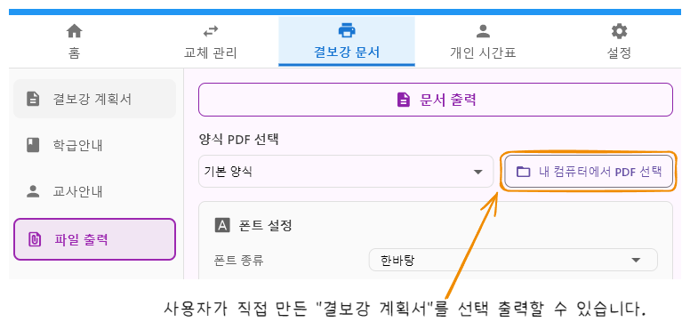
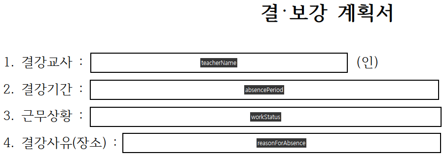

# 양식 PDF 제작 가이드

## 📋 개요

결보강 계획서를 출력할 때 사용할 PDF 양식 파일을 제작하는 방법입니다.

**핵심 개념:**

- 양식 PDF는 **폼 필드(Form Field)**를 사용하여 데이터를 자동으로 채웁니다
- 각 필드에는 **고유한 이름**이 지정되어 있어야 합니다
- 프로그램은 이 필드 이름을 통해 데이터를 PDF에 자동 입력합니다
-

## 🛠️ 제작 방법

### 1단계: PDF 파일 준비

1. 결보강 계획서 양식을 PDF 파일로 생성합니다
2. PDF 편집 프로그램을 사용합니다
   - **추천 프로그램:** Adobe Acrobat, PDF Editor 등
   - 폼 필드(Form Field) 작성 기능이 있는 프로그램이어야 합니다

### 2단계: 텍스트 폼 필드 추가

1. PDF 편집 프로그램에서 **텍스트 폼 필드(Text Form Field)**를 추가합니다
2. 각 필드의 **"필드 이름"**을 아래 표에 맞게 정확히 지정합니다
3. 필드 이름은 대소문자를 구분하므로 정확히 입력해야 합니다

### 3단계: 양식 파일 지정

1. 완성된 PDF 파일을 저장합니다
2. 프로그램의 "파일 출력" 화면에서 양식 PDF를 선택합니다

---

## 📝 지원 필드 목록

### 기본 정보 필드

| 표시 이름 | 필드 이름          | 설명                                    |
| ----------- | -------------------- | ----------------------------------------- |
| 결강교사  | `teacherName`      | 결강한 교사의 이름                      |
| 결강기간  | `absencePeriod`    | 결강 기간 (예: 2024.01.15 ~ 2024.01.19) |
| 근무상황  | `workStatus`       | 근무 상황 (예: 출장, 연가, 병가 등)     |
| 결강사유  | `reasonForAbsence` | 결강 사유                               |
| 학교명    | `schoolName`       | 학교 이름                               |
| 설명      | `notes`            | 추가 설명 (여러 줄 가능)                |

 

### 테이블 필드 (결강, 보강/수업변경, 수업 교체)

**⚠️ 중요:** 테이블의 각 행은 `.0`, `.1`, `.2` ... `.14` 형식으로 번호를 지정해야 합니다.

#### 결강 정보 테이블

| 표시 이름 | 필드 이름                                 | 예시                                      |
| ----------- | ------------------------------------------- | ------------------------------------------- |
| 결강일    | `date.0`, `date.1`, `date.2` ...          | 첫 번째 행:`date.0`, 두 번째 행: `date.1` |
| 교시      | `period.0`, `period.1`, `period.2` ...    | 첫 번째 행:`period.0`                     |
| 학년      | `grade.0`, `grade.1`, `grade.2` ...       | 첫 번째 행:`grade.0`                      |
| 반        | `class.0`, `class.1`, `class.2` ...       | 첫 번째 행:`class.0`                      |
| 과목      | `subject.0`, `subject.1`, `subject.2` ... | 첫 번째 행:`subject.0`                    |

#### 보강/수업변경 정보 테이블

| 표시 이름 | 필드 이름                                    | 예시                    |
| ----------- | ---------------------------------------------- | ------------------------- |
| 과목      | `2subject.0`, `2subject.1`, `2subject.2` ... | 첫 번째 행:`2subject.0` |
| 교사 성명 | `2teacher.0`, `2teacher.1`, `2teacher.2` ... | 첫 번째 행:`2teacher.0` |

#### 수업 교체 정보 테이블

| 표시 이름 | 필드 이름                                    | 예시                    |
| ----------- | ---------------------------------------------- | ------------------------- |
| 교체일    | `3date.0`, `3date.1`, `3date.2` ...          | 첫 번째 행:`3date.0`    |
| 교시      | `3period.0`, `3period.1`, `3period.2` ...    | 첫 번째 행:`3period.0`  |
| 과목      | `3subject.0`, `3subject.1`, `3subject.2` ... | 첫 번째 행:`3subject.0` |
| 교사 성명 | `3teacher.0`, `3teacher.1`, `3teacher.2` ... | 첫 번째 행:`3teacher.0` |

#### 비고 테이블

| 표시 이름 | 필드 이름                                 | 예시                   |
| ----------- | ------------------------------------------- | ------------------------ |
| 비고      | `remarks.0`, `remarks.1`, `remarks.2` ... | 첫 번째 행:`remarks.0` |

---

| 표시 이름 | 필드 이름     |
| ----------- | --------------- |
| 설명      | `notes`       |
| 학교명    | `schoolName` |

## ⚠️ 주의사항

1. **필드 이름 정확성**

   - 필드 이름은 정확히 일치해야 합니다 (대소문자 구분)
   - 오타가 있으면 데이터가 채워지지 않습니다
2. **테이블 행 번호**

   - 테이블의 각 행은 `.0`, `.1`, `.2` 형식으로 순서대로 지정해야 합니다
   - 최대 15개 행까지 지원합니다 (`.0` ~ `.14`)
3. **필드 타입**

   - 모든 필드는 **텍스트 폼 필드(Text Form Field)**로 생성해야 합니다
   - 다른 타입의 필드는 인식되지 않을 수 있습니다
4. **필수 필드**

   - 모든 필드가 필수는 아니지만, 사용하려는 필드는 반드시 지정해야 합니다

---

## 🔍 문제 해결

**Q: 필드 이름을 지정했는데 데이터가 채워지지 않아요**

- 필드 이름의 대소문자와 철자를 다시 확인하세요
- PDF 편집 프로그램에서 필드 이름이 정확히 저장되었는지 확인하세요

**Q: 테이블의 두 번째 행부터 데이터가 안 들어가요**

- 행 번호가 `.0`, `.1`, `.2` 형식으로 순서대로 지정되었는지 확인하세요
- 첫 번째 행은 반드시 `.0`으로 시작해야 합니다

**Q: 어떤 필드가 필수인가요?**

- 필수 필드는 없습니다
- 사용하려는 필드만 지정하면 됩니다
