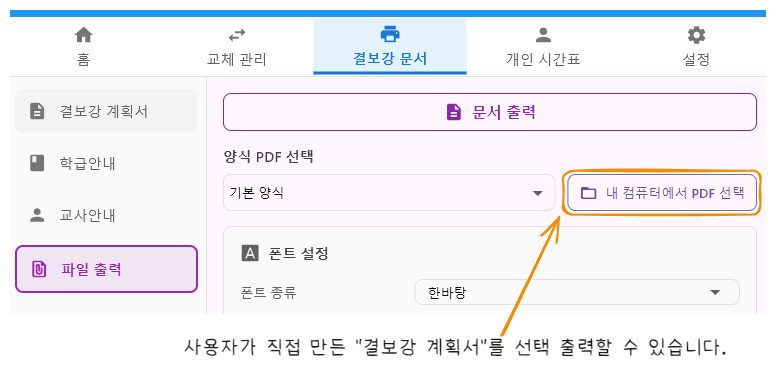
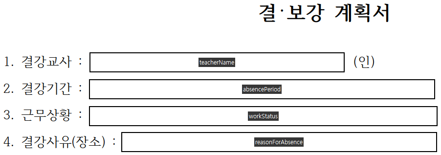
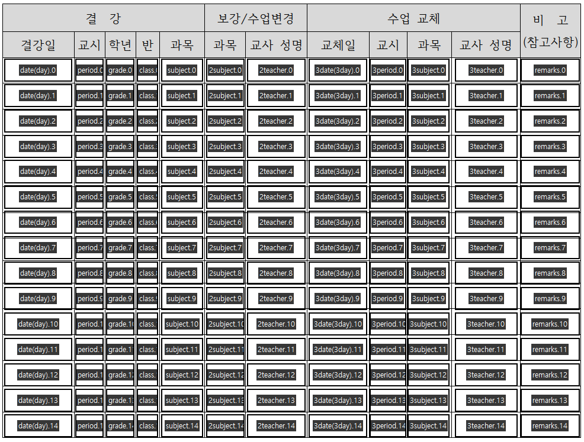

# 양식 PDF 제작 가이드

## 개요

결보강 계획서를 출력할 때 사용할 PDF 양식 파일을 제작하는 방법입니다.

**핵심 개념:**

- 양식 PDF는 **폼 필드(Form Field)**를 사용하여 데이터를 자동으로 채웁니다.
- 각 필드에는 **고유한 이름**이 지정되어 있어야 합니다.
- 프로그램은 이 필드 이름을 통해 데이터를 PDF에 자동 입력합니다.

**기본 제공 양식:**

- **문서 > 계획서** 화면에서 **양식 1**, **양식 2**를 선택하면 별도 파일 없이 바로 사용할 수 있습니다.
- 학교 양식에 맞게 수정이 필요할 때만 아래 방법으로 **사용자 지정 PDF**를 만듭니다.

---

## 제작 방법

### 1단계: PDF 파일 준비

1. 결보강 계획서 양식을 PDF 파일로 준비합니다.
2. PDF 편집 프로그램을 사용합니다.
   - **추천:** Adobe Acrobat, PDF Editor 등
   - **텍스트 폼 필드(Text Form Field)** 작성 기능이 있어야 합니다.

### 2단계: 텍스트 폼 필드 추가

1. PDF 편집 프로그램에서 **텍스트 폼 필드**를 추가합니다.
2. 각 필드의 **필드 이름**을 아래 표와 같이 정확히 지정합니다.
3. 필드 이름은 **대소문자를 구분**합니다.

### 3단계: 양식 파일 지정

1. 완성된 PDF 파일을 저장합니다.
2. **문서 > 계획서** 화면의 **양식 PDF 선택**에서 **파일 찾기**로 지정합니다.

---

## 지원 필드 목록

### 기본 정보 필드

| 표시 이름 | 필드 이름 | 설명 |
| ----------- | ----------- | ------ |
| 결강교사 | `teacherName` | 결강한 교사의 이름 |
| 결강기간 | `absencePeriod` | 결강 기간 (예: 2024.01.15 ~ 2024.01.19) |
| 근무상황 | `workStatus` | 근무 상황 (예: 출장, 연가, 병가 등) |
| 결강사유 | `reasonForAbsence` | 결강 사유 |
| 학교명 | `schoolName` | 학교 이름 |
| 설명 | `notes` | 추가 설명 (여러 줄 가능) |

### 테이블 필드 (결강, 보강/수업변경, 수업 교체, 비고)

**중요:** 테이블의 각 행은 `.0`, `.1`, `.2` … `.14` 형식으로 번호를 지정해야 합니다. (최대 15행)

#### 결강 정보 테이블

| 표시 이름 | 필드 이름 | 예시 |
| ----------- | ----------- | ------ |
| 결강일 | `date.0`, `date.1`, … | 첫 번째 행: `date.0` |
| 요일 | `day.0`, `day.1`, … | 첫 번째 행: `day.0` (예: 월) |
| 교시 | `period.0`, `period.1`, … | 첫 번째 행: `period.0` |
| 학년 | `grade.0`, `grade.1`, … | 첫 번째 행: `grade.0` |
| 반 | `class.0`, `class.1`, … | 첫 번째 행: `class.0` |
| 과목 | `subject.0`, `subject.1`, … | 첫 번째 행: `subject.0` |
| 교사 | `teacher.0`, `teacher.1`, … | 첫 번째 행: `teacher.0` |

**복합 필드 (선택):** 결강일과 요일을 한 칸에 넣을 때 `date(day).0` 형식을 사용할 수 있습니다.  
프로그램이 `10.27(월)` 형태로 채웁니다.

#### 보강/수업변경 정보 테이블

| 표시 이름 | 필드 이름 | 예시 |
| ----------- | ----------- | ------ |
| 과목 | `2subject.0`, `2subject.1`, … | 첫 번째 행: `2subject.0` |
| 교사 성명 | `2teacher.0`, `2teacher.1`, … | 첫 번째 행: `2teacher.0` |

#### 수업 교체 정보 테이블

| 표시 이름 | 필드 이름 | 예시 |
| ----------- | ----------- | ------ |
| 교체일 | `3date.0`, `3date.1`, … | 첫 번째 행: `3date.0` |
| 요일 | `3day.0`, `3day.1`, … | 첫 번째 행: `3day.0` |
| 교시 | `3period.0`, `3period.1`, … | 첫 번째 행: `3period.0` |
| 과목 | `3subject.0`, `3subject.1`, … | 첫 번째 행: `3subject.0` |
| 교사 성명 | `3teacher.0`, `3teacher.1`, … | 첫 번째 행: `3teacher.0` |

**복합 필드 (선택):** 교체일과 요일을 한 칸에 넣을 때 `3date(3day).0` 형식을 사용할 수 있습니다.  
프로그램이 `2025-01-15(수)` 형태로 채웁니다.

#### 비고 테이블

| 표시 이름 | 필드 이름 | 예시 |
| ----------- | ----------- | ------ |
| 비고 | `remarks.0`, `remarks.1`, … | 첫 번째 행: `remarks.0` |

---

| 표시 이름 | 필드 이름 |
| ----------- | ----------- |
| 설명 | `notes` |
| 학교명 | `schoolName` |

---

## 주의사항

1. **필드 이름 정확성**
   - 필드 이름은 표와 **완전히 일치**해야 합니다 (대소문자 구분).
   - `className`이 아니라 **`class`** 입니다.
   - 오타가 있으면 해당 칸에 데이터가 채워지지 않습니다.

2. **테이블 행 번호**
   - 각 행은 `.0`, `.1`, `.2` 순서로 지정합니다.
   - 첫 번째 행은 반드시 `.0`으로 시작합니다.
   - 최대 15개 행 (`.0` ~ `.14`)까지 지원합니다.

3. **필드 타입**
   - 모든 필드는 **텍스트 폼 필드(Text Form Field)**로 생성하세요.
   - 다른 타입은 인식되지 않을 수 있습니다.

4. **필수 필드**
   - 필수 필드는 없습니다. 사용할 칸만 필드 이름을 지정하면 됩니다.

---

## 문제 해결

**Q: 필드 이름을 지정했는데 데이터가 채워지지 않아요**

- 대소문자·철자를 다시 확인하세요.
- PDF 편집 프로그램에서 필드 이름이 저장되었는지 확인하세요.
- **계획서** 화면에서 올바른 양식(양식 1·2 또는 사용자 PDF)이 선택되었는지 확인하세요.

**Q: 테이블의 두 번째 행부터 데이터가 안 들어가요**

- 행 번호가 `.0`, `.1`, `.2` 형식인지 확인하세요.
- `.1`을 건너뛰고 `.2`만 쓰면 두 번째 행 데이터가 비어 있을 수 있습니다.

**Q: 요일이 출력되지 않아요**

- `day.0` / `3day.0` 필드를 추가했는지 확인하세요.
- 또는 복합 필드 `date(day).0` / `3date(3day).0`을 사용할 수 있습니다.

**Q: 어떤 필드가 필수인가요?**

- 필수 필드는 없습니다. 학교 양식에 맞는 필드만 지정하면 됩니다.

**Q: 기본 양식만 쓰면 되나요?**

- 대부분 **양식 1** 또는 **양식 2**로 충분합니다.
- 학교 전용 양식이 있을 때만 이 가이드대로 PDF를 제작하세요.
